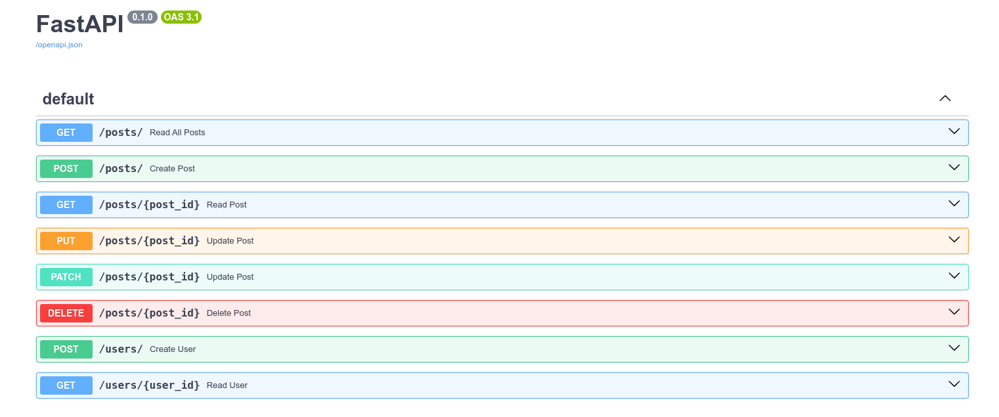

# BlogApplication Fast API 

> Uma aplicação blog criada com Fast API, integrada com um banco de dados MySQL, usando SQLAlchemy para a interação com o banco de dados. Definindo modelos de dados com Pydantic e usando Uvicorn para servir a aplicação de forma asyncrona.

#### Funcionalidades

---

- Criação de usuário
- leitura de usuário
- criação de post
- listagem de todos os posts
- lista um post especifico
- atualização parcial de um post
- atualização integral de um post
- deleção de um post

#### Tecnologia usada

---

1. **FastAPI**: O framework web de alto desempenho para construção d e APIs com Python.
2. **Uvicorn**: Servidor ASGI (Asynchronous Server Gateway Interface) que permite executar aplicativos FastAPI.
3. **SQLAlchemy**: Biblioteca de mapeamento objeto-relacional (ORM) para interagir com bancos de dados SQL.
4. **PyMySQL**: Driver Python para MySQL, usado com o SQLAlchemy para se conectar a bancos de dados MySQL.

#### Requisitos do ambiente

---

- Certifique-se de ter o Docker instalado em sua máquina
- Você precisará do Python 3.9.x para executar o projeto localmente
- Para gerenciar o banco de dados MySQL, você pode utilizar o MySQL Workbench ou um outro qualquer instalado

#### Instalação

---

- Clone o projeto
  - `git clone https://github.com/bywilliams/blog_application_api.git`
- Acesse a pasta do projeto e rode o seguinte comando Docker:
  - `docker-compose up -d`  para iniciar os contêiners  sem bloquear o terminal

#### Gerenciamento do Banco de Dados:

---

- Cria um banco de dados com o nome de `BlogApplication`
- Use o MySQL Workbench ou uma outra ferramenta gráfica de gerenciamento de banco de dados para visualizar as modificações ao usar a aplicação

#### Executando e testando aplicação

---

- Primeiro inicie o ambiente virtual
  - Na linha de comando digite: `source env/bin/activate`
- Iniciando servidor Uvicorn
  - Para iniciar o servidor use o comando: `uvicorn main:app --reload`
- Faça os testes acessando o endereço e a documentação gerada pela Fast API no link abaixo:
  - `http://127.0.0.1:8000/docs`

#### Página e documentação Fast API da aplicação para realização de testes

---

## Obrigado pela leitura da documentação! 